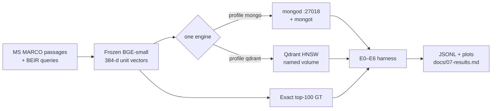

<div align="center">


# VectorDB Proof

**When is a dedicated vector database the better local choice than MongoDB `$vectorSearch`?**

A measured answer on one inventoried 16 GB laptop — not a vendor bake-off.

[](LICENSE)
[](requirements.txt)
[](compose/docker-compose.yml)
[](docs/07-results.md)

[Results](docs/07-results.md) · [Protocol](docs/05-protocol.md) · [Threats](docs/06-threats-to-validity.md) · [Cite](CITATION.cff)

</div>

---

## Finding (through 500K)

On this host, **concurrency 1**, **unfiltered** kNN, **Recall@10 ≥ 0.95**:

- Through **250K**, both engines stay interactive (p95 &lt; 50 ms). Mongo is faster; Qdrant uses less RAM. No latency crossover.
- At **500K iso-config** (median of 3 trials), Mongo p95 is **69 ms** — the first time it misses the 50 ms bar. Qdrant stays at **32 ms** and **1.08 GB** RSS.
- That Mongo median is pulled by the two trials immediately after a ~8 min ingest/index (mongot CPU spiked to ~340%). Trial 3 and the iso-recall sweep are **15–17 ms**. Once warm, Mongo is still faster.
- Iso-recall still picks **ef = 32** for both engines at 100K, 250K, and 500K.

| N | Mongo p95 | Qdrant p95 | p95 ratio | Mongo RSS | Qdrant RSS |
|---|---:|---:|---:|---:|---:|
| 10K | 12.0 ms | 31.7 ms | 2.64 | 1.07 GB | — |
| 50K | 15.1 ms | 32.6 ms | 2.16 | 1.76 GB | 0.21 GB |
| 100K | 16.5 ms | 32.4 ms | 1.96 | 2.11 GB | 0.29 GB |
| 250K | 19.3 ms | 33.5 ms | 1.73 | 2.29 GB | 0.61 GB |
| **500K** | **69.4 ms** | **31.7 ms** | **0.46** | **2.20 GB** | **1.08 GB** |

At **8-way concurrency** and 500K, both stay under 50 ms p95 (Mongo 35 ms, Qdrant 34 ms). Mongo p99 is 148 ms at 8-way. **1M was not run.**

Full tables, every figure, and what we did *not* measure: **[docs/07-results.md](docs/07-results.md)**.

## Is this enough?

**Yes — for the question this laptop can answer.** Through 500K, a dedicated vector DB is **not required** for warm unfiltered kNN at Recall@10 ≥ 0.95. Mongo is faster once warm; Qdrant uses about half the RAM; filters do not flip the ranking.

**No — if you need a hard scale cliff.** Protocol 1M was not run. The iso-config Mongo 69 ms point is a post-ingest warmup artifact, not a crossover. E5 did not restart the container (first-50-no-warmup only). This is one 16 GB Windows box and preview `mongot`. It does not speak for Atlas, 1536-d embeddings, or write-heavy production.

Optional next cell: **1M**, only if the host stays off the pagefile. 5M is out of scope on this machine.

## Figures

**Headline (iso-recall, the decision number):**

<p align="center">
  
</p>

**Why the 500K Mongo iso-config spike is not the decision number:**

<p align="center">
  
</p>

<p align="center">
  
  
</p>
<p align="center">
  
  
</p>
<p align="center">
  
  
</p>
<p align="center">
  
  
</p>
<p align="center">
  
  
</p>

<p align="center"><sub>Interactive discussion threshold: p95 &lt; 50 ms, p99 &lt; 100 ms. Ground truth is exact top-100 inner product on the frozen unit vectors. Fifteen committed figures live in <code>experiments/plots/</code>.</sub></p>

## Why this study exists

Most “Mongo vs Qdrant” posts mix Atlas, different embedding models, and iso-config HNSW knobs. This repo freezes the things that actually move the answer:

| Locked choice | Value |
|---|---|
| Host | Dell Inspiron 14 Plus 7440 · Intel Core Ultra 7 155H · **~15.46 GiB soldered RAM** |
| Engines | MongoDB 8.2 Community + `mongot` **xor** Qdrant 1.15.4 (Docker profiles) |
| Embeddings | `BAAI/bge-small-en-v1.5` · 384-d · L2-normalized · **encoded once** |
| Distance | Cosine / inner product on unit vectors |
| Ground truth | Exact top-100 IP (NumPy) |
| Primary k | 10 · headline comparison is **iso-recall**, not iso-config |
| Seed | `20260912` |



## Manuscripts

| # | Chapter | What it settles |
|---|---|---|
| 1 | [Foundations](docs/01-foundations.md) | Embeddings, distance, HNSW |
| 2 | [MongoDB vector search](docs/02-mongodb-vector-search.md) | `$vectorSearch` and local `mongot` |
| 3 | [Qdrant architecture](docs/03-qdrant-architecture.md) | Collection model and HNSW knobs |
| 4 | [Hardware and budget](docs/04-hardware-and-budget.md) | Why 16 GB is the binding constraint |
| 5 | [Protocol](docs/05-protocol.md) | E0–E6, iso-recall, discard rules |
| 6 | [Threats to validity](docs/06-threats-to-validity.md) | What this box cannot claim |
| 7 | [Results](docs/07-results.md) | Generated only from measured JSONL |

## Hard rules

- Run **one engine at a time**. Compose profiles `mongo` and `qdrant` are mutually exclusive.
- Cap Docker Desktop / WSL2 at **10 GB RAM** on this 16 GB host.
- If the pagefile is active during a timed window, **discard the trial**.
- 5 million 384-d vectors are not a primary condition on this machine.
- On Windows, Qdrant storage must be a **Docker named volume**. An NTFS/9p bind mount panics the HNSW optimizer.

## Reproduce

Python 3.10+ and Docker Desktop.

```powershell
git clone https://github.com/drakeRAGE/mongo-vs-qdrant-local.git
cd mongo-vs-qdrant-local
python -m venv .venv
.\.venv\Scripts\Activate.ps1
pip install -r requirements.txt
```

On this apparatus, Docker MongoDB is published on **host port 27018** because a native `mongod` already occupies 27017.

```powershell
python -m src.runners.study prepare --max-docs 10000

.\scripts\one_engine.ps1 qdrant
python scripts\check_host.py --expect qdrant
python -m src.runners.study run --engine qdrant --experiments E0,E1 --max-n 10000

.\scripts\one_engine.ps1 mongo
python scripts\check_host.py --expect mongo
python -m src.runners.study run --engine mongo --experiments E0,E1 --max-n 10000

python -m src.runners.study analyze
```

Iso-config uses HNSW `M=16`, `efConstruction=200`, search width 64. Iso-recall sweeps `{32,64,128,256}` and picks the smallest width with Recall@10 ≥ 0.95.

Committed artifacts you can inspect without rerunning:

- [`experiments/results/`](experiments/results/) — JSONL / CSV for every completed cell
- [`experiments/plots/`](experiments/plots/) — 15 figures
- [`data/manifests/MANIFEST.json`](data/manifests/MANIFEST.json) — SHA-256 of the frozen embedding files (vectors themselves are not in git)

## Layout

```text
docs/                manuscripts + banner / social card
compose/             docker compose profiles (mongo xor qdrant)
src/embed            corpus download + frozen BGE-small encode
src/exact            exact top-100 ground truth
src/engines          MongoDB and Qdrant adapters
src/metrics          latency, recall, RSS
src/runners          E0–E6 + analyze / plots
scripts/             one_engine.ps1, check_host.py
experiments/plots    committed figures
experiments/results  committed JSONL / CSV
data/                local artifacts (gitignored except MANIFEST)
```

## Out of scope

Atlas, Kubernetes, sharding, LLM/RAG answer quality, Intel NPU embeddings, `knnBeta`, pgvector, 5M-scale primary claims, native Windows `mongot` (it does not exist). Community `mongot` is **preview** software.

## License and data

Code and manuscripts are [MIT](LICENSE). The frozen corpus is streamed from public Hugging Face sets (`Tevatron/msmarco-passage-corpus`, BEIR/MS MARCO queries). Those sources keep their own licenses; this repo does not redistribute the raw passages or embedding matrices. See [NOTICE.md](NOTICE.md).

## Citation

```bibtex
@software{vectordb_proof_2026,
  title  = {VectorDB Proof: MongoDB \$vectorSearch vs Qdrant on a 16 GB laptop},
  author = {Deepak},
  year   = {2026},
  url    = {https://github.com/drakeRAGE/mongo-vs-qdrant-local}
}
```

Also [`CITATION.cff`](CITATION.cff).
