<div align="center">


# VectorDB Proof

Local measurement of when Qdrant is the better choice than MongoDB Community `$vectorSearch` (`mongod` + `mongot`) on one inventoried 16 GB laptop.

[](docs/07-results.md)
[](docs/07-results.md)
[](docs/05-protocol.md)
[](LICENSE)

[Working results](docs/07-results.md) · [Protocol](docs/05-protocol.md) · [Threats](docs/06-threats-to-validity.md) · [Manuscripts](#manuscripts)

</div>

---

## Status

The study is **open**. The frozen corpus, harness, and protocol are locked. The scale ladder has been run through **500K**. The protocol’s 1M cell has not been run. Nothing below is a product recommendation or a claim about Atlas, cloud Qdrant, or another machine.

| Phase | State |
|---|---|
| E0 harness (10K, Recall@10 ≈ 1.0) | Done |
| E1 scale ladder, iso-config | Done at 10K, 50K, 100K, 250K, 500K |
| E1 iso-recall sweep | Done at 100K, 250K, 500K |
| E2 concurrency {1, 4, 8} | Done at 100K, 250K, 500K |
| E3 filtered ANN | Done at 500K (also recorded at smaller N) |
| E4 ingest / time-to-searchable | Done at 100K, 250K, 500K |
| E5 first-50 queries, no warmup | Done — **not** a container restart |
| E6 RSS from `docker stats` | Done at each completed N |
| **1M** (protocol primary remaining cell) | **Not run** |
| 5M | Out of scope on this host |

Discussion thresholds, not trophies: p95 &lt; 50 ms, p99 &lt; 100 ms, Recall@10 ≥ 0.95. Headline comparison is **iso-recall**, not iso-config.

---

## Question

On this host, at what corpus size — if any — does a dedicated HNSW engine become the better local choice than Community `$vectorSearch` for unfiltered and lightly filtered kNN?

Locked factors: Dell Inspiron 14 Plus 7440, Intel Core Ultra 7 155H, ~15.46 GiB soldered RAM, Docker one engine at a time, `BAAI/bge-small-en-v1.5` 384-d L2-normalized once, cosine / inner product, exact top-100 ground truth, seed `20260912`. Query embedding SHA is unchanged from the 10K prefix through 500K (`1f4538d26c541d73c26541429b3e122e1d8f56a198a5e48bc0a56aa7b7ea9200`).

---

## Settled on this apparatus (through 500K)

These statements are supported by the committed JSONL. They are limited to this box, these images, this frozen matrix, and concurrency-1 unfiltered kNN unless noted.

1. **The harness matches both engines to the same truth.** At 10K and high search width, Recall@10 is 0.999–1.000 on Mongo and 1.000 on Qdrant (E0).
2. **Warm unfiltered kNN stays interactive through 500K on both engines** once the index is searchable and the process is past ingest. Iso-recall operating point (smallest ef with Recall@10 ≥ 0.95) is **ef = 32** for both at 100K, 250K, and 500K. Mongo p95 is 14.5 / 16.4 / 15.4 ms. Qdrant p95 is 32.8 / 33.3 / 31.8 ms.
3. **Qdrant’s p95 is almost flat in N.** Iso-config medians sit between 31.7 ms and 33.5 ms from 10K to 500K.
4. **Mongo is faster on the warm path; Qdrant uses less RAM.** At 500K, Qdrant RSS is 1.08 GB against Mongo’s ~2.2 GB (`mongod` + `mongot`). That gap exists at every N with a usable RSS sample.
5. **Iso-config and iso-recall are not the same experiment.** The 500K Mongo iso-config median p95 of 69.4 ms is the median of three trials, two of which ran immediately after a ~470 s ingest while `mongot` CPU was ~340%. Trial 3 and the iso-recall sweep are 15–17 ms. That 69 ms figure is a post-ingest tail, not a measured latency crossover.
6. **Filtered ANN at 500K does not invert the latency ranking.** Qdrant stays ~31–33 ms across 1 / 10 / 50 / 100% selectivity. Mongo stays below that. Filtered Recall@10 is scored against *unfiltered* neighbors, so it tracks selectivity (~0.016 / 0.10 / 0.50 / 0.98), not index quality.
7. **Time-to-searchable at 500K is the same order of magnitude** (Mongo 470 s, Qdrant 494 s, batch 256). The discarded 1908 s Qdrant point was an NTFS bind-mount failure, not a scale result. On Windows, Qdrant storage has to be a Docker named volume.
8. **5M 384-d vectors are not a primary condition** on 16 GB soldered RAM. Community `mongot` is preview software.

Iso-recall operating points (decision numbers used so far):

| N | Mongo p95 | Qdrant p95 | ef picked | Recall@10 (M / Q) |
|---|---:|---:|---:|---|
| 100K | 14.5 ms | 32.8 ms | 32 | 0.989 / 0.992 |
| 250K | 16.4 ms | 33.3 ms | 32 | 0.982 / 0.992 |
| 500K | 15.4 ms | 31.8 ms | 32 | 0.967 / 0.988 |

Iso-config medians (protocol table, including the post-ingest Mongo trials):

| N | Mongo p95 | Qdrant p95 | p95(Q)/p95(M) | Mongo RSS | Qdrant RSS |
|---|---:|---:|---:|---:|---:|
| 10K | 12.0 ms | 31.7 ms | 2.64 | 1.07 GB | — |
| 50K | 15.1 ms | 32.6 ms | 2.16 | 1.76 GB | 0.21 GB |
| 100K | 16.5 ms | 32.4 ms | 1.96 | 2.11 GB | 0.29 GB |
| 250K | 19.3 ms | 33.5 ms | 1.73 | 2.29 GB | 0.61 GB |
| 500K | 69.4 ms | 31.7 ms | 0.46 | 2.20 GB | 1.08 GB |

---

## Still open

These are the reasons the study is not closed.

1. **1M.** Protocol question 3 (iso-recall at 1M) and question 7 (whether Mongo’s two-process RSS forces paging first) are unanswered. The 1M cell runs only if the host stays off the pagefile.
2. **Whether a dedicated engine is *required*.** Through 500K, warm unfiltered kNN does not require one for latency. That can still change at 1M, under 8-way load after a real restart, or when RAM — not p95 — is the constraint.
3. **Mongo 500K ingest tail.** We have not repeated 500K iso-config after a cooling gap. We do not yet know how much of the 69 ms median is “just warmed up” versus “this build is unstable at this size.”
4. **True cold start.** E5 is the first 50 queries with warmup skipped. The protocol’s container restart has not been run.
5. **Concurrency ranking.** At 100K and 250K, Qdrant p95 crossed 50 ms at 8 clients (51 ms, 54 ms). At 500K it did not (34 ms). E2 also used iso-config ef=64, not the iso-recall pick. Until that is repeated, we do not treat 8-way ranking as settled.
6. **Writes, deletes, skewed tenants, 768-d, quantization, Atlas.** Not in this study.

---

## Figures

Generated from `experiments/results/*.jsonl`. Empty or noisy series mean the cell is thin, not that a winner was assumed.

**Working comparison (iso-recall p95 vs N).** Both engines remain under 50 ms at the ef=32 operating point.

<p align="center">
  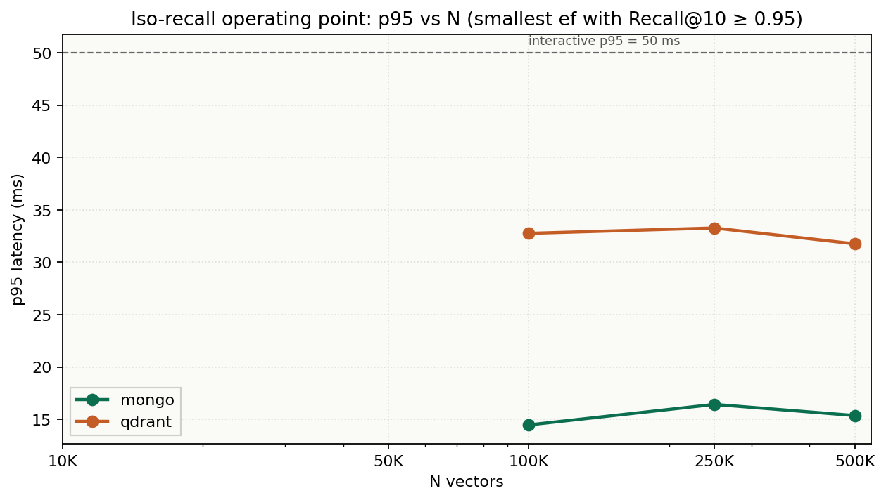
</p>

**Iso-config median versus iso-recall.** Left panel is why 500K Mongo looks like a crossover in the protocol table. Right panel is the warm operating point.

<p align="center">
  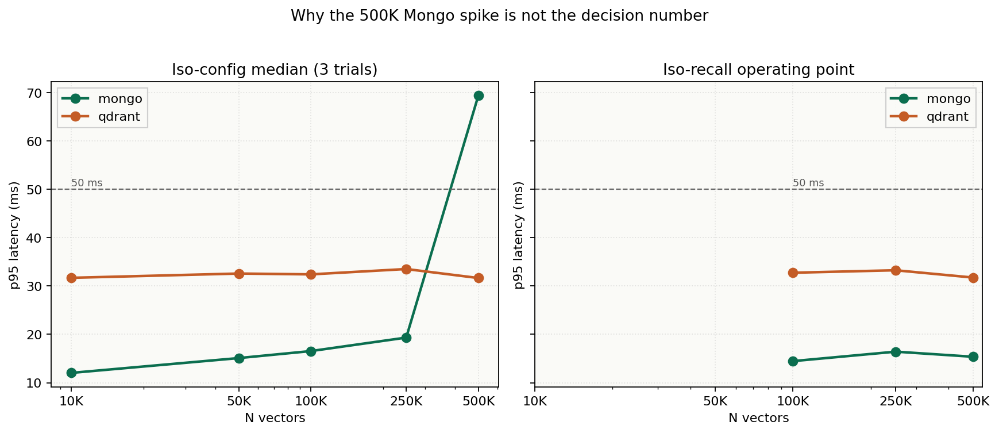
</p>

**Scale, RAM, ingest**

<p align="center">
  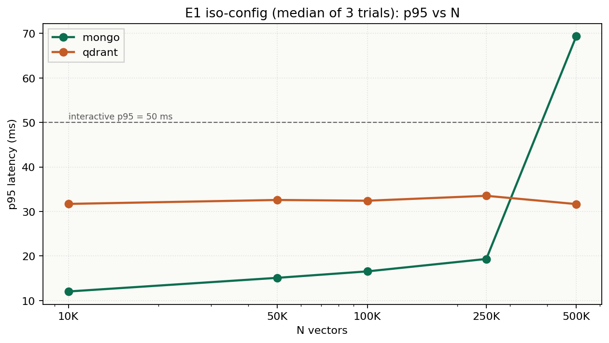
  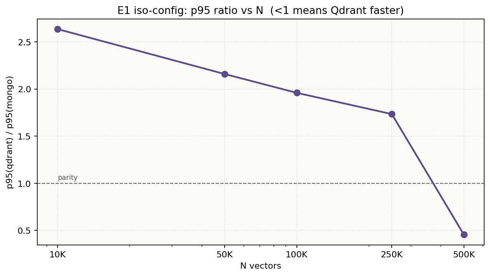
</p>
<p align="center">
  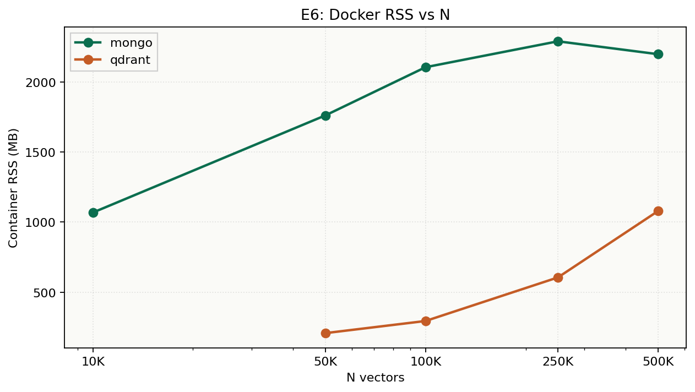
  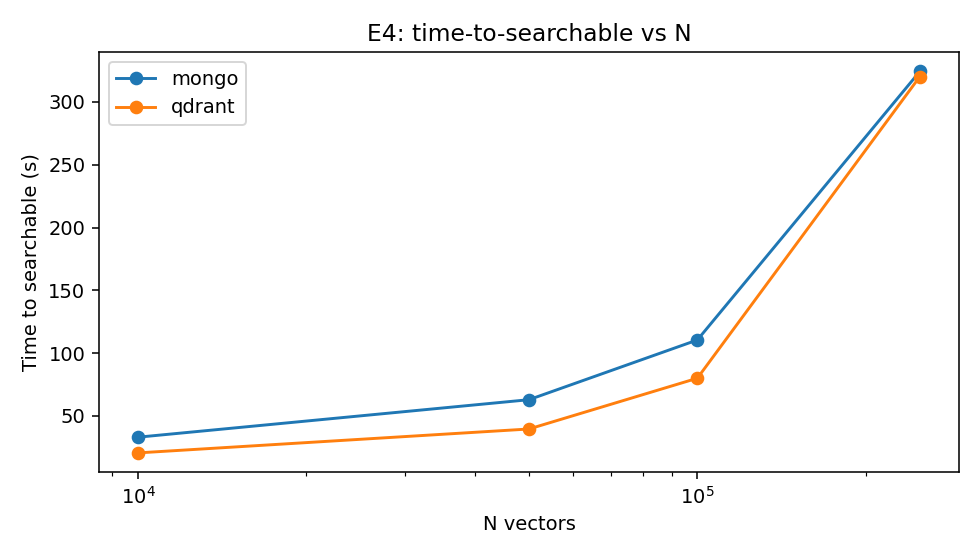
</p>

**Load and filters**

<p align="center">
  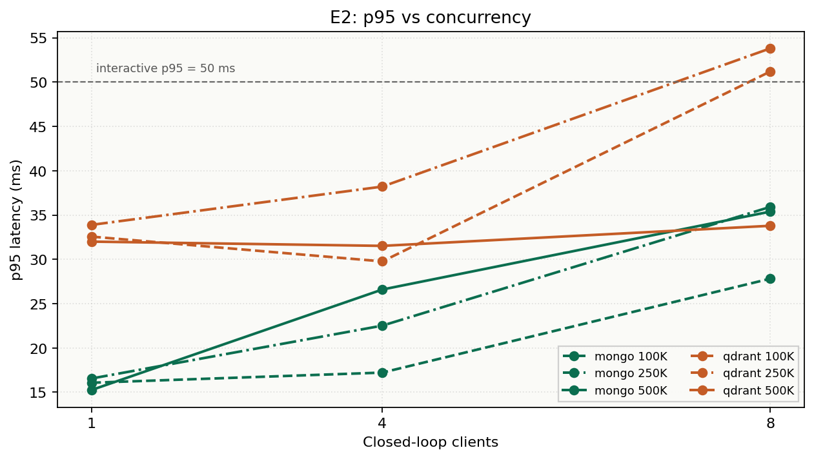
  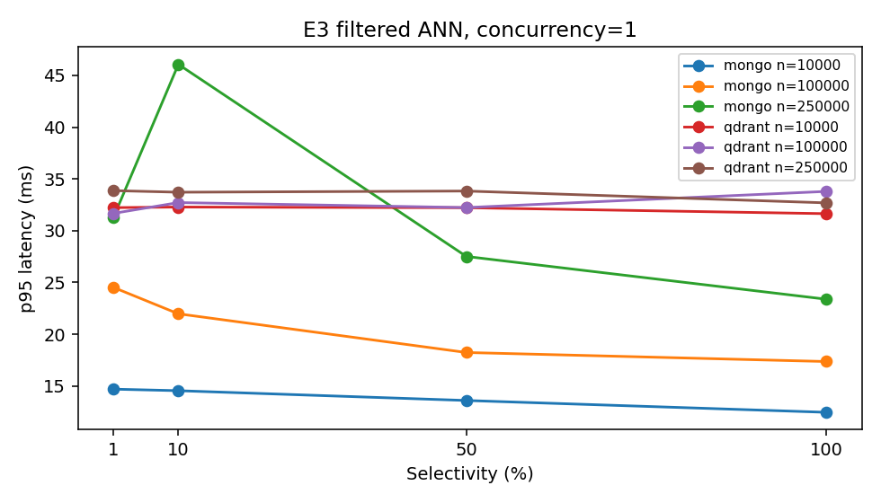
</p>

**Quality knobs and first queries**

<p align="center">
  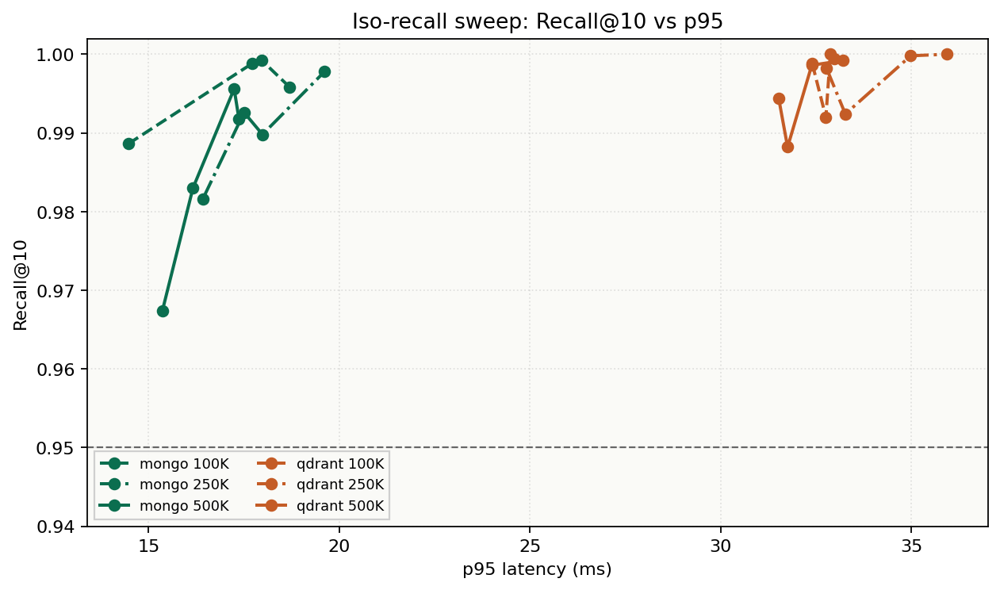
  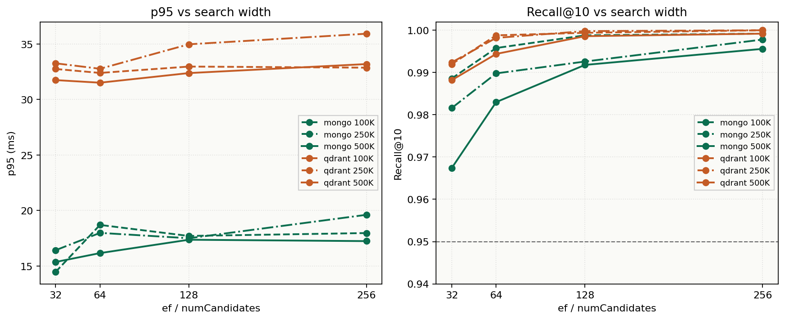
</p>
<p align="center">
  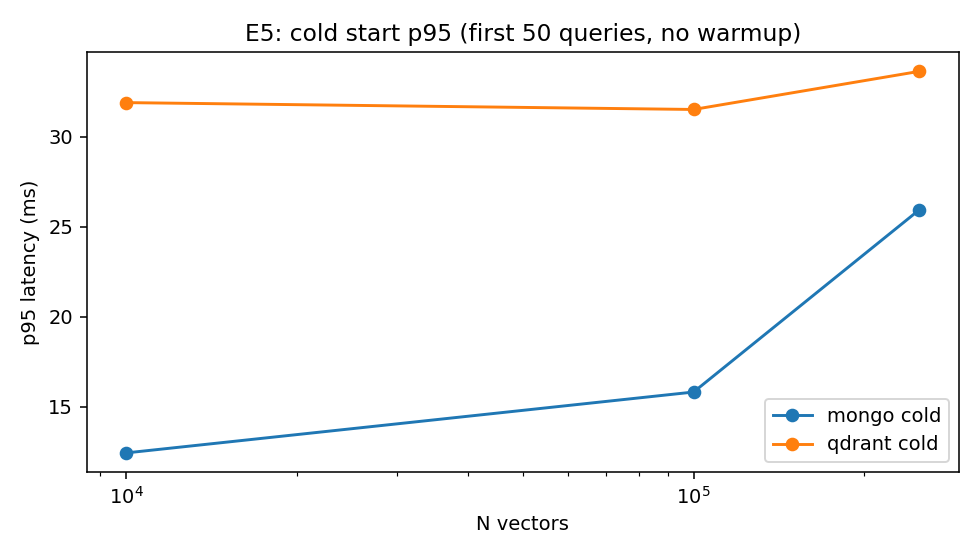
  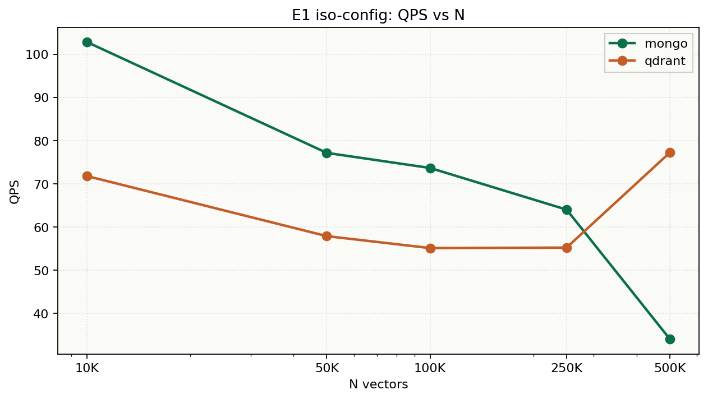
</p>

Also in [`experiments/plots/`](experiments/plots/): p99 vs N, Recall@10 vs N, QPS vs concurrency. Source rows: [`experiments/results/`](experiments/results/). Narrative chapter: [`docs/07-results.md`](docs/07-results.md).

---

## Method

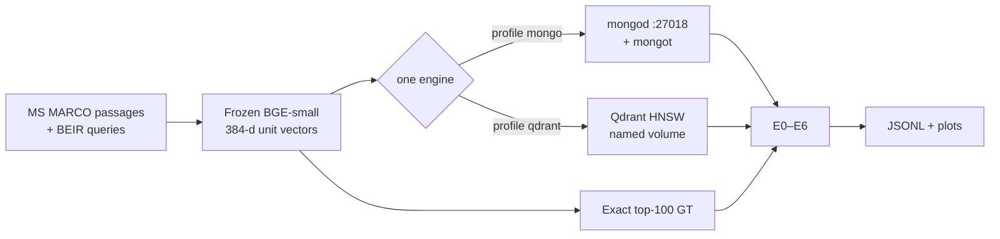

| Item | Value |
|---|---|
| Host | Inspiron 14 Plus 7440, Ultra 7 155H, 16 GB LPDDR5 soldered |
| Engines | MongoDB 8.2 Community + `mongot` 1.70.4 **xor** Qdrant 1.15.4 |
| Embeddings | `BAAI/bge-small-en-v1.5`, 384-d, L2-normalized, encoded once |
| Distance | Cosine / IP on unit vectors |
| Ground truth | Exact top-100 inner product (NumPy) |
| Iso-config | M=16, efConstruction=200, search width 64 |
| Iso-recall | Sweep {32, 64, 128, 256}; pick smallest width with Recall@10 ≥ 0.95 |
| Queries | 50 warmup + 500 measured; 3 trials; median of trial percentiles |
| Seed | `20260912` |

One engine at a time. Docker / WSL2 capped at 10 GB on this host. A trial is discarded if the pagefile is active in the timed window, both profiles are up, measured n &lt; 200, or error rate &gt; 1%.

---

## Manuscripts

| # | Chapter |
|---|---|
| 1 | [Foundations](docs/01-foundations.md) |
| 2 | [MongoDB vector search](docs/02-mongodb-vector-search.md) |
| 3 | [Qdrant architecture](docs/03-qdrant-architecture.md) |
| 4 | [Hardware and budget](docs/04-hardware-and-budget.md) |
| 5 | [Protocol](docs/05-protocol.md) |
| 6 | [Threats to validity](docs/06-threats-to-validity.md) |
| 7 | [Results](docs/07-results.md) — generated from JSONL only |

---

## Reproduce

Python 3.10+ and Docker Desktop. On this machine Docker `mongod` is published on **27018** because a native `mongod` already occupies 27017.

```powershell
git clone https://github.com/drakeRAGE/mongo-vs-qdrant-local.git
cd mongo-vs-qdrant-local
python -m venv .venv
.\.venv\Scripts\Activate.ps1
pip install -r requirements.txt

python -m src.runners.study prepare --max-docs 10000
.\scripts\one_engine.ps1 qdrant
python scripts\check_host.py --expect qdrant
python -m src.runners.study run --engine qdrant --experiments E0,E1 --max-n 10000
.\scripts\one_engine.ps1 mongo
python scripts\check_host.py --expect mongo
python -m src.runners.study run --engine mongo --experiments E0,E1 --max-n 10000
python -m src.runners.study analyze
```

500K ladder: `.\scripts\continue_500k.ps1` (or `continue_500k_engines.ps1` if embeddings are already frozen). Next protocol cell, when the host allows it: `prepare --max-docs 1000000`, then the same xor engine runs with `--min-n 1000000 --max-n 1000000`.

---

## License and data

Code and manuscripts are [MIT](LICENSE). Passages are streamed from `Tevatron/msmarco-passage-corpus` and BEIR/MS MARCO queries. This repository does not ship the raw text or the embedding matrices; [`data/manifests/MANIFEST.json`](data/manifests/MANIFEST.json) holds the SHA-256 of the frozen files. Upstream licenses: [NOTICE.md](NOTICE.md).

```bibtex
@software{vectordb_proof_2026,
  title  = {VectorDB Proof: MongoDB \$vectorSearch vs Qdrant on a 16 GB laptop},
  author = {Deepak},
  year   = {2026},
  url    = {https://github.com/drakeRAGE/mongo-vs-qdrant-local},
  note   = {Working study; measured through 500K}
}
```
