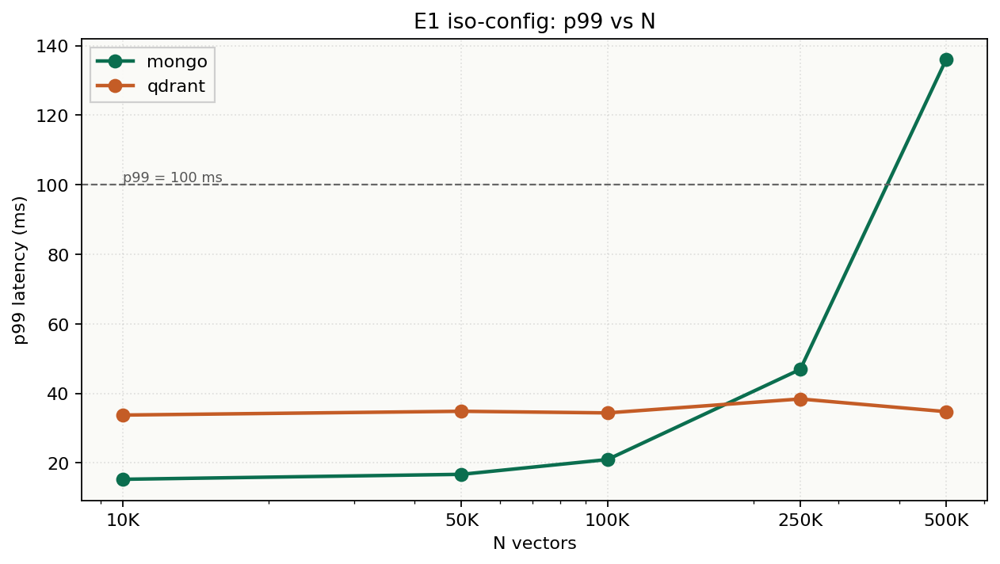
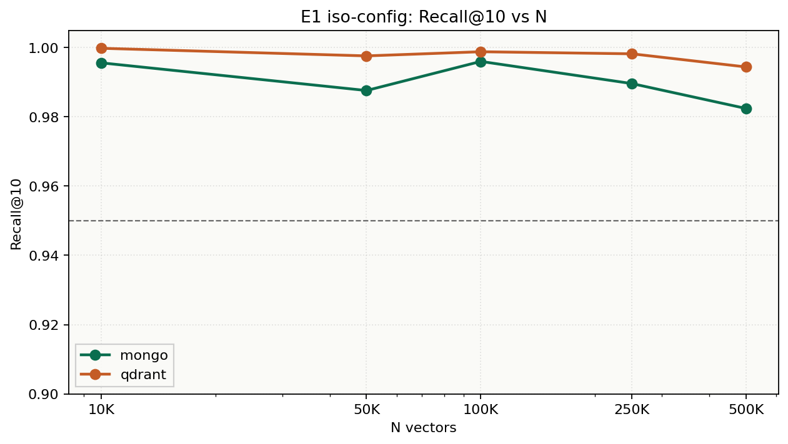
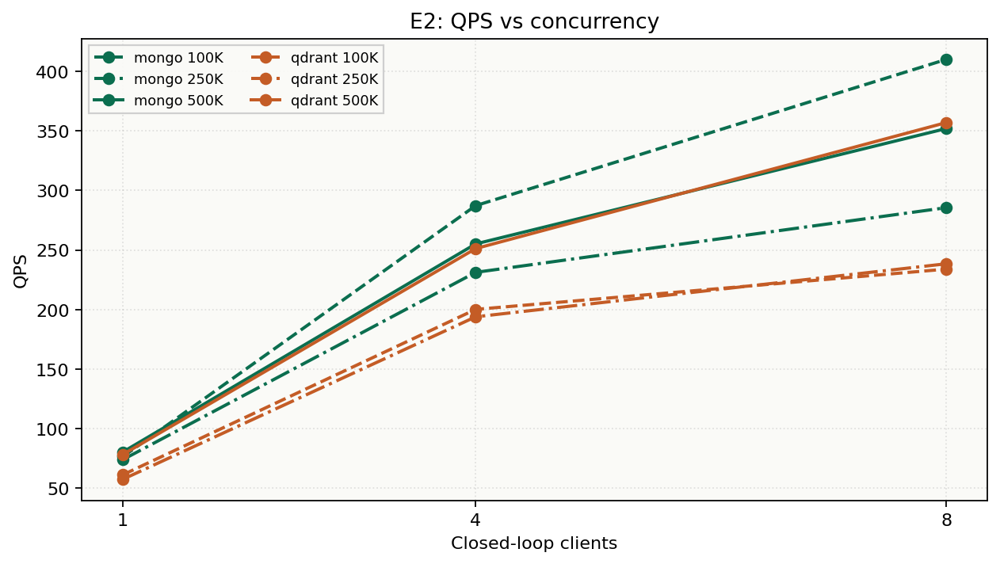

# 07 — Results (data-only)

This chapter is generated from `experiments/results/*.jsonl`.
It does not assume a winner. Empty sections mean the cell has not been run yet.

Rows loaded: **174**.

## What was actually run

- Engines: mongo, qdrant
- Slice sizes present: [10000, 50000, 100000, 250000, 500000]
- Experiments: ['E0', 'E1', 'E2', 'E3', 'E4', 'E5']

## E0 harness validation

| engine | Recall@10 | p95 ms | n_measured | invalid |
|---|---:|---:|---:|---|
| mongo | 1.000 | 15.922 | 500.000 | False |
| mongo | 1.000 | 16.067 | 500.000 | False |
| mongo | 0.999 | 15.666 | 500.000 | False |
| qdrant | 1.000 | 32.327 | 500.000 | False |
| qdrant | 1.000 | 30.081 | 500.000 | False |
| qdrant | 1.000 | 32.327 | 500.000 | False |
| qdrant | 1.000 | 33.429 | 500.000 | False |

1 E0 row(s) omitted because Recall@10 < 0.5 (query-order alignment bug on an early Qdrant trial).

## E1 scale ladder (iso-config, median p95)

| engine | N | p50 ms | p95 ms | p99 ms | QPS | Recall@10 | RSS MB |
|---|---:|---:|---:|---:|---:|---:|---:|
| mongo | 10000 | 8.974 | 12.031 | 15.280 | 102.785 | 0.996 | 1068.400 |
| qdrant | 10000 | 8.194 | 31.705 | 33.751 | 71.788 | 1.000 | 0.000 |
| mongo | 50000 | 12.784 | 15.097 | 16.707 | 77.149 | 0.988 | 1761.800 |
| qdrant | 50000 | 9.912 | 32.590 | 34.841 | 57.897 | 0.998 | 207.900 |
| mongo | 100000 | 13.284 | 16.546 | 20.959 | 73.663 | 0.996 | 2105.700 |
| qdrant | 100000 | 19.307 | 32.418 | 34.373 | 55.133 | 0.999 | 294.500 |
| mongo | 250000 | 14.822 | 19.336 | 46.891 | 64.022 | 0.990 | 2290.500 |
| qdrant | 250000 | 11.079 | 33.523 | 38.384 | 55.245 | 0.998 | 605.400 |
| mongo | 500000 | 16.905 | 69.389 | 136.028 | 34.088 | 0.982 | 2198.600 |
| qdrant | 500000 | 6.779 | 31.664 | 34.729 | 77.230 | 0.994 | 1079.300 |

### Protocol questions (observed, not hypothesized)

- mongo: largest observed N meeting p95 < 50 ms and Recall@10 ≥ 0.95 is **250000**.
- qdrant: largest observed N meeting p95 < 50 ms and Recall@10 ≥ 0.95 is **500000**.
- At N=10000 iso-config, p95(qdrant)/p95(mongo) = 2.635.
- At N=50000 iso-config, p95(qdrant)/p95(mongo) = 2.159.
- At N=100000 iso-config, p95(qdrant)/p95(mongo) = 1.959.
- At N=250000 iso-config, p95(qdrant)/p95(mongo) = 1.734.
- At N=500000 iso-config, p95(qdrant)/p95(mongo) = 0.456.

## E1 iso-recall sweep

| engine | N | ef | p95 ms | Recall@10 | QPS |
|---|---:|---:|---:|---:|---:|
| mongo | 100000 | 32 | 14.466 | 0.989 | 79.073 |
| mongo | 100000 | 64 | 18.702 | 0.996 | 74.157 |
| mongo | 100000 | 128 | 17.708 | 0.999 | 71.317 |
| mongo | 100000 | 256 | 17.970 | 0.999 | 67.482 |
| qdrant | 100000 | 32 | 32.756 | 0.992 | 59.729 |
| qdrant | 100000 | 64 | 32.399 | 0.999 | 65.839 |
| qdrant | 100000 | 128 | 32.971 | 0.999 | 63.033 |
| qdrant | 100000 | 256 | 32.873 | 1.000 | 64.232 |
| mongo | 250000 | 32 | 16.422 | 0.982 | 73.239 |
| mongo | 250000 | 64 | 17.985 | 0.990 | 69.022 |
| mongo | 250000 | 128 | 17.503 | 0.993 | 68.992 |
| mongo | 250000 | 256 | 19.614 | 0.998 | 62.209 |
| qdrant | 250000 | 32 | 33.266 | 0.992 | 47.898 |
| qdrant | 250000 | 64 | 32.774 | 0.998 | 56.837 |
| qdrant | 250000 | 128 | 34.979 | 1.000 | 50.228 |
| qdrant | 250000 | 256 | 35.931 | 1.000 | 44.655 |
| mongo | 500000 | 32 | 15.362 | 0.967 | 81.406 |
| mongo | 500000 | 64 | 16.164 | 0.983 | 79.410 |
| mongo | 500000 | 128 | 17.367 | 0.992 | 77.788 |
| mongo | 500000 | 256 | 17.243 | 0.996 | 70.298 |
| qdrant | 500000 | 32 | 31.752 | 0.988 | 73.720 |
| qdrant | 500000 | 64 | 31.519 | 0.994 | 78.125 |
| qdrant | 500000 | 128 | 32.385 | 0.999 | 70.388 |
| qdrant | 500000 | 256 | 33.197 | 0.999 | 64.420 |

Operating point rule: smallest ef with Recall@10 ≥ 0.95. If none, the Pareto plot is the result — no winner is declared.

- mongo n=100000: smallest ef at ≥0.95 is **32** (p95=14.466 ms).
- mongo n=250000: smallest ef at ≥0.95 is **32** (p95=16.422 ms).
- mongo n=500000: smallest ef at ≥0.95 is **32** (p95=15.362 ms).
- qdrant n=100000: smallest ef at ≥0.95 is **32** (p95=32.756 ms).
- qdrant n=250000: smallest ef at ≥0.95 is **32** (p95=33.266 ms).
- qdrant n=500000: smallest ef at ≥0.95 is **32** (p95=31.752 ms).

## E2 concurrency

| engine | N | conc | p95 ms | QPS |
|---|---:|---:|---:|---:|
| mongo | 100000 | 1 | 16.073 | 76.367 |
| mongo | 100000 | 4 | 17.220 | 287.278 |
| mongo | 100000 | 8 | 27.818 | 410.123 |
| qdrant | 100000 | 1 | 32.568 | 61.110 |
| qdrant | 100000 | 4 | 29.768 | 200.095 |
| qdrant | 100000 | 8 | 51.200 | 233.900 |
| mongo | 250000 | 1 | 16.549 | 73.841 |
| mongo | 250000 | 4 | 22.520 | 231.213 |
| mongo | 250000 | 8 | 35.920 | 285.561 |
| qdrant | 250000 | 1 | 33.889 | 57.317 |
| qdrant | 250000 | 4 | 38.213 | 193.867 |
| qdrant | 250000 | 8 | 53.811 | 238.402 |
| mongo | 500000 | 1 | 15.249 | 80.247 |
| mongo | 500000 | 4 | 26.595 | 255.116 |
| mongo | 500000 | 8 | 35.389 | 352.033 |
| qdrant | 500000 | 1 | 32.003 | 78.129 |
| qdrant | 500000 | 4 | 31.521 | 251.204 |
| qdrant | 500000 | 8 | 33.788 | 357.046 |

## E3 filtered ANN

| engine | N | sel | conc | p95 ms | Recall@10 |
|---|---:|---|---:|---:|---:|
| mongo | 100000 | 1 | 1 | 24.520 | 0.011 |
| mongo | 10000 | 1 | 1 | 14.700 | 0.011 |
| mongo | 250000 | 1 | 1 | 31.304 | 0.013 |
| mongo | 500000 | 1 | 1 | 22.782 | 0.016 |
| mongo | 100000 | 1 | 4 | 17.616 | 0.011 |
| mongo | 10000 | 1 | 4 | 17.239 | 0.011 |
| mongo | 250000 | 1 | 4 | 36.288 | 0.013 |
| mongo | 500000 | 1 | 4 | 23.740 | 0.016 |
| mongo | 100000 | 10 | 1 | 21.976 | 0.104 |
| mongo | 10000 | 10 | 1 | 14.550 | 0.102 |
| mongo | 250000 | 10 | 1 | 46.065 | 0.104 |
| mongo | 500000 | 10 | 1 | 29.678 | 0.104 |
| mongo | 100000 | 10 | 4 | 24.474 | 0.104 |
| mongo | 10000 | 10 | 4 | 16.253 | 0.102 |
| mongo | 250000 | 10 | 4 | 43.184 | 0.104 |
| mongo | 500000 | 10 | 4 | 32.951 | 0.104 |
| mongo | 100000 | 100 | 1 | 17.366 | 0.995 |
| mongo | 10000 | 100 | 1 | 12.462 | 0.995 |
| mongo | 250000 | 100 | 1 | 23.382 | 0.990 |
| mongo | 500000 | 100 | 1 | 14.469 | 0.984 |
| mongo | 100000 | 100 | 4 | 19.183 | 0.996 |
| mongo | 10000 | 100 | 4 | 17.001 | 0.995 |
| mongo | 250000 | 100 | 4 | 19.929 | 0.990 |
| mongo | 500000 | 100 | 4 | 25.324 | 0.981 |
| mongo | 100000 | 50 | 1 | 18.238 | 0.492 |
| mongo | 10000 | 50 | 1 | 13.604 | 0.503 |
| mongo | 250000 | 50 | 1 | 27.513 | 0.495 |
| mongo | 500000 | 50 | 1 | 20.675 | 0.496 |
| mongo | 100000 | 50 | 4 | 20.162 | 0.492 |
| mongo | 10000 | 50 | 4 | 16.763 | 0.503 |
| mongo | 250000 | 50 | 4 | 38.232 | 0.494 |
| mongo | 500000 | 50 | 4 | 33.277 | 0.496 |
| qdrant | 100000 | 1 | 1 | 31.674 | 0.011 |
| qdrant | 10000 | 1 | 1 | 32.227 | 0.011 |
| qdrant | 250000 | 1 | 1 | 33.871 | 0.013 |
| qdrant | 500000 | 1 | 1 | 31.579 | 0.016 |
| qdrant | 100000 | 1 | 4 | 33.764 | 0.011 |
| qdrant | 10000 | 1 | 4 | 28.857 | 0.011 |
| qdrant | 250000 | 1 | 4 | 35.194 | 0.013 |
| qdrant | 500000 | 1 | 4 | 30.385 | 0.016 |
| qdrant | 100000 | 10 | 1 | 32.716 | 0.104 |
| qdrant | 10000 | 10 | 1 | 32.285 | 0.102 |
| qdrant | 250000 | 10 | 1 | 33.717 | 0.104 |
| qdrant | 500000 | 10 | 1 | 32.259 | 0.104 |
| qdrant | 100000 | 10 | 4 | 29.708 | 0.104 |
| qdrant | 10000 | 10 | 4 | 26.995 | 0.102 |
| qdrant | 250000 | 10 | 4 | 37.963 | 0.104 |
| qdrant | 500000 | 10 | 4 | 31.682 | 0.104 |
| qdrant | 100000 | 100 | 1 | 33.796 | 0.999 |
| qdrant | 10000 | 100 | 1 | 31.644 | 1.000 |
| qdrant | 250000 | 100 | 1 | 32.688 | 0.998 |
| qdrant | 500000 | 100 | 1 | 32.259 | 0.994 |
| qdrant | 100000 | 100 | 4 | 31.299 | 0.999 |
| qdrant | 10000 | 100 | 4 | 30.661 | 1.000 |
| qdrant | 250000 | 100 | 4 | 33.788 | 0.998 |
| qdrant | 500000 | 100 | 4 | 25.106 | 0.994 |
| qdrant | 100000 | 50 | 1 | 32.235 | 0.475 |
| qdrant | 10000 | 50 | 1 | 32.221 | 0.504 |
| qdrant | 250000 | 50 | 1 | 33.831 | 0.495 |
| qdrant | 500000 | 50 | 1 | 32.354 | 0.497 |
| qdrant | 100000 | 50 | 4 | 35.076 | 0.475 |
| qdrant | 10000 | 50 | 4 | 27.482 | 0.504 |
| qdrant | 250000 | 50 | 4 | 31.171 | 0.495 |
| qdrant | 500000 | 50 | 4 | 31.530 | 0.497 |

## E4 ingestion / time-to-searchable

| engine | N | index_build_s | time_to_searchable_s | RSS MB |
|---|---:|---:|---:|---:|
| mongo | 10000 | 12.025 | 11.717 | 1226.100 |
| mongo | 50000 | 62.925 | 62.885 | 1766.400 |
| mongo | 100000 | 110.486 | 110.436 | 2110.000 |
| mongo | 10000 | 38.248 | 38.211 | 909.600 |
| mongo | 10000 | 33.078 | 33.030 | 1067.200 |
| mongo | 10000 | 27.855 | 27.811 | 1150.200 |
| mongo | 10000 | 40.872 | 40.562 | 1759.200 |
| mongo | 250000 | 324.451 | 324.378 | 2288.000 |
| mongo | 500000 | 469.917 | 469.581 | 2410.700 |
| qdrant | 10000 | 6.645 | 6.645 | 266.900 |
| qdrant | 50000 | 39.559 | 39.558 | 236.700 |
| qdrant | 100000 | 79.983 | 79.983 | 389.100 |
| qdrant | 10000 | 20.285 | 20.285 | 157.500 |
| qdrant | 50000 | 1908.069 | 1908.069 | 107.100 |
| qdrant | 10000 | 31.273 | 31.273 | 0.000 |
| qdrant | 10000 | 25.555 | 25.555 | 0.000 |
| qdrant | 10000 | 20.762 | 20.762 | 0.000 |
| qdrant | 10000 | 22.772 | 22.772 | 0.000 |
| qdrant | 10000 | 19.642 | 19.642 | 0.000 |
| qdrant | 10000 | 6.418 | 6.418 | 237.700 |
| qdrant | 250000 | 320.265 | 320.263 | 641.300 |
| qdrant | 500000 | 494.132 | 494.132 | 1144.800 |

## E5 cold start

| engine | N | p50 ms | p95 ms | n_measured |
|---|---:|---:|---:|---:|
| mongo | 100000 | 12.592 | 15.810 | 50.000 |
| mongo | 10000 | 9.881 | 12.428 | 50.000 |
| mongo | 250000 | 18.323 | 25.939 | 50.000 |
| mongo | 500000 | 13.912 | 18.456 | 50.000 |
| qdrant | 100000 | 8.944 | 31.512 | 50.000 |
| qdrant | 10000 | 7.997 | 31.893 | 50.000 |
| qdrant | 250000 | 13.304 | 33.631 | 50.000 |
| qdrant | 500000 | 7.818 | 32.026 | 50.000 |

## E6 resource envelope

## Figure index

- `e1_p95_vs_n`: `experiments/plots/e1_p95_vs_n.png`
- `e1_iso_recall_p95_vs_n`: `experiments/plots/e1_iso_recall_p95_vs_n.png`
- `e1_p95_iso_config_vs_iso_recall`: `experiments/plots/e1_p95_iso_config_vs_iso_recall.png`
- `e1_p99_vs_n`: `experiments/plots/e1_p99_vs_n.png`
- `e1_qps_vs_n`: `experiments/plots/e1_qps_vs_n.png`
- `e1_recall_vs_n`: `experiments/plots/e1_recall_vs_n.png`
- `e1_p95_ratio_vs_n`: `experiments/plots/e1_p95_ratio_vs_n.png`
- `e1_pareto_recall_p95`: `experiments/plots/e1_pareto_recall_p95.png`
- `e1_iso_recall_vs_ef`: `experiments/plots/e1_iso_recall_vs_ef.png`
- `e2_p95_vs_concurrency`: `experiments/plots/e2_p95_vs_concurrency.png`
- `e2_qps_vs_concurrency`: `experiments/plots/e2_qps_vs_concurrency.png`
- `e3_filter_p95`: `experiments/plots/e3_filter_p95.png`
- `e4_ingest_vs_n`: `experiments/plots/e4_ingest_vs_n.png`
- `e5_cold_p95`: `experiments/plots/e5_cold_p95.png`
- `e6_rss_vs_n`: `experiments/plots/e6_rss_vs_n.png`

## Interpretation constraints

- Iso-config cells are not iso-quality.
- Differences under 10% p95 at N≤100K are treated as operationally weak.
- Missing engine or missing N is not evidence that the missing side is slower.
- Community `mongot` is preview software; image IDs belong with the JSONL.
- Filtered Recall@10 is scored against *unfiltered* exact neighbors, so it tracks selectivity, not index quality.
- Recall@50 / Recall@100 in the CSV are not meaningful when the timed query used k=10.
- Mongo 500K iso-config median p95 is dominated by the two trials immediately after ingest (mongot CPU spike). Iso-recall / later trials are the warm number.

## Run notes (this apparatus)

- Observed slice sizes in JSONL: [10000, 50000, 100000, 250000, 500000].
- Embeddings: BGE-small 384-d, L2-normalized, frozen files reused across engines.
- Host port 27018 is Docker `mongod`; a native `mongod` already occupies 27017.
- RSS comes from `docker stats` CLI when the Python Docker SDK is absent.
- Qdrant image v1.15.4 with client 1.19.0: compatibility check disabled.
- `mongot` 1.70.4; Community `$vectorSearch` is public preview.
